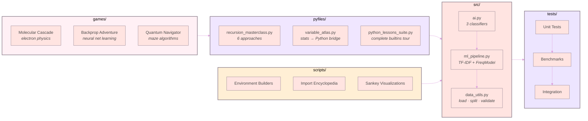

<div align="center">


<br>

[](https://github.com/Cazzy-Aporbo/velvet-python/actions)
&nbsp;
[](https://www.python.org/)
&nbsp;
[](LICENSE)
&nbsp;
[](https://github.com/Cazzy-Aporbo/velvet-python/commits)

<br>

*A personal Python laboratory. Classification algorithms built from first principles.*
*Recursive thinking explored six ways. Sankey diagrams from real data.*
*Games that teach chemistry through electron physics.*
*Everything here runs.*

</div>

<br>

## The Idea

Most Python repositories are either tutorials that simplify past the point of usefulness, or production code that's impenetrable without three months of onboarding. This is neither.

Every module in this repo exists because I needed to understand something deeply enough to build it from scratch — no frameworks hiding the math, no black-box imports replacing the thinking. When I implement Naive Bayes, the Bayesian math is in the docstring. When I write a TF-IDF classifier, the vector algebra is visible in every method. When I compute Fibonacci, I do it six different ways and time them all.

Started January 2025. Still going.

<br>

## Architecture

<div align="center">



</div>

<br>

## What Lives Here

<div align="center">
<table>
<tr>
<td width="50%" valign="top">

### `src/` — The Core Library

**Three classification strategies in `ai.py`:**

| Strategy | Math | Lines |
|:---------|:-----|------:|
| Rule-based | Pattern matching | ~15 |
| Naive Bayes | P(c\|text) ∝ Π P(w\|c) · P(c) | ~70 |
| Cosine Similarity | cos(θ) = A·B / (\|\|A\|\| · \|\|B\|\|) | ~60 |

**Two ML pipelines in `ml_pipeline.py`:**

| Model | Approach | Key Insight |
|:------|:---------|:------------|
| WordFrequencyModel | Token overlap scoring | Baseline — fast, transparent |
| TFIDFModel | TF·IDF weighted cosine | Rare words matter most |

Plus: `confusion_matrix()`, `evaluate()`, `train_test_split()` — all from scratch, no sklearn.

</td>
<td width="50%" valign="top">

### `pyfiles/` — The Sketchbook

**`recursion_masterclass.py`** — Factorial and Fibonacci computed six ways:
- Naive recursion (O(2ⁿ) — feel the pain)
- Memoized with `@lru_cache`
- Bottom-up dynamic programming
- Explicit stack (no recursion at all)
- Tail-call style accumulator
- Mutual recursion (`is_even` ↔ `is_odd`)

Plus: N-Queens backtracking, permutation generation, DFS tree traversal. Every function has inline tests.

**`variable_atlas.py`** — Variables as contracts, not boxes. Maps statistical notation (y, X, β) to Python with dataclasses, validation, and a complete OLS regression built on the standard library.

**`python_lessons_suite.py`** — A 493-line teaching program that tours Python's builtins with live demonstrations.

</td>
</tr>
</table>
</div>

<div align="center">
<table>
<tr>
<td width="50%" valign="top">

### `scripts/` — Standalone Tools

- **Environment Builders** — Audit your Python installation, generate reproducible setups, test package compatibility
- **Import Encyclopedia** — Map every module in Python's standard library
- **Sankey Toolkit** — Plotly-based flow visualizations with Titanic passenger data
- **JH Presentation** — A talk I gave at Johns Hopkins
- **Games** — Backpropagation adventure, pattern recognition challenges, recursive thinking puzzles, chaotic space navigation

</td>
<td width="50%" valign="top">

### `data/` — Real Datasets

| Domain | Contents |
|:-------|:---------|
| Health | Patient records, breast cancer research, supplement studies |
| NLP | Doctor-patient dialogue corpora |
| Finance | Time series, market data |
| Epidemiology | Our World in Data exports |
| Demographics | Census data, fisherman mercury studies |
| Transport | Airline passenger datasets |

Nothing synthetic unless explicitly labeled.

</td>
</tr>
</table>
</div>

<div align="center">
<table>
<tr>
<td width="50%" valign="top">

### `pyfiles/games/` — Learning Through Play

| Game | What It Teaches |
|:-----|:----------------|
| Molecular Cascade | Electron shells, valence bonds, chain reactions — via Pygame |
| Cardiovascular Model | Hemodynamics simulation |
| Quantum Navigator | Maze solving with quantum-inspired algorithms |
| Crystal Engine | Lattice structures and symmetry |
| Aerospace Systems | Orbital mechanics fundamentals |

</td>
<td width="50%" valign="top">

### `tests/` — The Proof

```
tests/
├── test_ai.py                  # 3 classifiers, parametrized
├── test_ml_pipeline.py         # Both models + confusion matrix
├── test_pipeline_integration.py # train → split → evaluate
├── test_benchmark.py           # Speed gates
├── test_benchmark_performance.py
└── test_example.py             # Smoke tests
```

Every `src/` function has a corresponding test.
Benchmarks enforce sub-100ms training and sub-500ms for 9000 predictions.

</td>
</tr>
</table>
</div>

<br>

## Quick Start

```bash
git clone https://github.com/Cazzy-Aporbo/velvet-python.git
cd velvet-python
python -m venv .venv && source .venv/bin/activate
pip install -r requirements.txt
pytest tests/ -v
```

Or with the Makefile:

```bash
make install    # pip install -r requirements.txt
make test       # pytest tests/ -v --tb=short
make lint       # ruff check src/ tests/
make check      # lint + test in one pass
make clean      # remove __pycache__, .pytest_cache, etc.
```

<br>

## Code Samples

<div align="center">

### Naive Bayes — The Math Behind Spam Filters

</div>

```python
from src.ai import NaiveBayesClassifier

nb = NaiveBayesClassifier(alpha=1.0)  # Laplace smoothing

nb.train(
    texts=["great movie loved it", "terrible waste of time",
           "amazing performance", "boring and dull"],
    labels=["positive", "negative", "positive", "negative"],
)

# P(positive | "loved the movie") ∝ P("loved"|pos) · P("the"|pos) · P("movie"|pos) · P(pos)
nb.predict("loved the movie")           # → "positive"
nb.predict_proba("loved the movie")     # → {"positive": 0.83, "negative": 0.17}
```

<div align="center">

### TF-IDF — Why Rare Words Matter

</div>

```python
from src.ml_pipeline import TFIDFModel, evaluate
from src.data_utils import load_dataset, train_test_split

data = load_dataset()
train, test = train_test_split(data, test_ratio=0.3, seed=42)

model = TFIDFModel()
model.train(
    texts=[t for t, _ in train],
    labels=[l for _, l in train],
)

# TF("learning", doc) = count("learning") / len(doc)
# IDF("learning") = log(N / docs_containing("learning"))
# Weight = TF × IDF — common words get low weight, distinctive words get high weight

accuracy = evaluate(model, test)
```

<div align="center">

### Recursion — Six Ways to Compute the Same Thing

</div>

```python
# From pyfiles/recursion_masterclass.py

factorial_recursive(6)           # 720  — classic, hits recursion limit at ~1000
factorial_iterative(6)           # 720  — no stack overhead
factorial_with_explicit_stack(6) # 720  — recursion without recursion
factorial_tail_like(6)           # 720  — accumulator pattern (Python doesn't optimize TCO, but the pattern teaches)

fib_recursive_naive(30)          # 832040 — takes ~0.3s (O(2ⁿ) — feel it)
fib_recursive_memo(30)           # 832040 — takes ~0.00001s (O(n) with @lru_cache)
fib_bottom_up(30)                # 832040 — takes ~0.00001s (O(n), O(1) space)
```

<br>

## Philosophy

<div align="center">
<table>
<tr>
<td width="33%" align="center" style="padding: 20px;">

**Build the math first**

If I can't derive it on paper,
I don't trust it in code.
Every classifier in `src/ai.py`
has its formula in the docstring.

</td>
<td width="33%" align="center" style="padding: 20px;">

**Multiple approaches**

One solution means you memorized it.
Three solutions means you understand it.
Fibonacci six ways. Classification three ways.
The comparison *is* the lesson.

</td>
<td width="33%" align="center" style="padding: 20px;">

**Everything runs**

No pseudocode. No placeholder functions.
No `# TODO: implement this`.
If it's in this repo, `python file.py`
produces output.

</td>
</tr>
</table>
</div>

<br>

## Contributing

See [`contributions.md`](contributions.md). The short version: fork, branch, test, PR. Format with ruff. If you add code to `src/`, add a test to `tests/`.

## License

MIT (code) &nbsp;·&nbsp; CC-BY-4.0 (documentation and datasets)

<div align="center">

<br>


**Cazzy Aporbo** · Started January 2025

<a href="https://github.com/Cazzy-Aporbo/velvet-python/issues">

</a>
&nbsp;
<a href="https://github.com/Cazzy-Aporbo/velvet-python/stargazers">

</a>
&nbsp;
<a href="https://github.com/Cazzy-Aporbo/velvet-python/fork">

</a>

</div>
