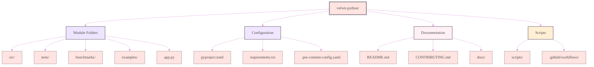
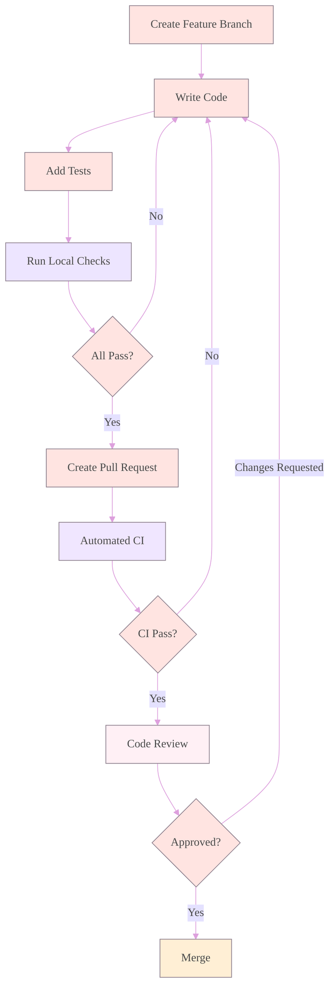

# Contributing to Velvet Python

<div align="center">


[](https://github.com/psf/black)
[](https://github.com/charliermarsh/ruff)
[](https://pytest.org)
[](http://mypy-lang.org/)
[](https://www.mkdocs.org/)

</div>

## Welcome Contributors

<div style="background: linear-gradient(135deg, #FFE4E1 0%, #F0E6FF 50%, #FFF0F5 100%); padding: 30px; border-radius: 20px; margin: 20px 0;">

Thank you for considering contributing to Velvet Python. This project thrives on community input, whether you're fixing bugs, adding features, improving documentation, or sharing performance insights.

I built this repository to be a collaborative learning resource. Every contribution that adds educational value or improves code quality is welcome. Your expertise, regardless of level, can help others on their Python journey.

</div>

## Contribution Philosophy

<div align="center">
<table style="width: 100%; border: none;">
<tr>
<td width="25%" align="center" style="background: linear-gradient(135deg, #FFE4E1, #EDE5FF); padding: 25px; border-radius: 15px;">
<h4 style="color: #8B7D8B;">Measure Impact</h4>
<p style="color: #706B70; font-size: 0.9em;">Every change should be measurable. Include benchmarks for performance claims.</p>
</td>
<td width="25%" align="center" style="background: linear-gradient(135deg, #EDE5FF, #F0E6FF); padding: 25px; border-radius: 15px;">
<h4 style="color: #8B7D8B;">Test Everything</h4>
<p style="color: #706B70; font-size: 0.9em;">Code without tests is incomplete. Aim for realistic test scenarios.</p>
</td>
<td width="25%" align="center" style="background: linear-gradient(135deg, #F0E6FF, #FFF0F5); padding: 25px; border-radius: 15px;">
<h4 style="color: #8B7D8B;">Document Clearly</h4>
<p style="color: #706B70; font-size: 0.9em;">Explain why, not just what. Future readers need context.</p>
</td>
<td width="25%" align="center" style="background: linear-gradient(135deg, #FFF0F5, #FFEFD5); padding: 25px; border-radius: 15px;">
<h4 style="color: #8B7D8B;">Maintain Aesthetic</h4>
<p style="color: #706B70; font-size: 0.9em;">Follow the established visual style and pastel theme.</p>
</td>
</tr>
</table>
</div>

## Getting Started

### Development Environment Setup

<div style="background: linear-gradient(180deg, #FFF0F5 0%, #FFFFFF 100%); padding: 30px; border-radius: 20px; margin: 20px 0;">

```bash
# Fork and clone the repository
git clone https://github.com/YOUR-USERNAME/velvet-python.git
cd velvet-python

# Create a virtual environment
python -m venv .venv
source .venv/bin/activate  # Windows: .venv\Scripts\activate

# Install development dependencies
pip install -U pip wheel setuptools
pip install -r requirements-dev.txt

# Install pre-commit hooks
pre-commit install

# Verify setup
python scripts/verify_setup.py
```

</div>

### Project Structure

<div align="center">



</div>

## Contribution Types

<details>
<summary><b style="color: #8B7D8B;">Bug Fixes (Click to expand)</b></summary>

<div style="background: linear-gradient(180deg, #FFE4E1 0%, #FFF0F5 100%); padding: 25px; border-radius: 15px; margin: 15px 0;">

### Reporting Bugs

Before creating a bug report, please check existing issues. When you create a bug report, include:

<table style="width: 100%; background: white; border-radius: 10px; padding: 20px;">
<tr>
<td style="padding: 15px; background: rgba(255, 228, 225, 0.3);">
<b style="color: #8B7D8B;">Environment Details</b><br>
<span style="color: #706B70;">Python version, OS, dependency versions</span>
</td>
</tr>
<tr>
<td style="padding: 15px; background: rgba(237, 229, 255, 0.3);">
<b style="color: #8B7D8B;">Minimal Reproduction</b><br>
<span style="color: #706B70;">Smallest code example that demonstrates the issue</span>
</td>
</tr>
<tr>
<td style="padding: 15px; background: rgba(240, 230, 255, 0.3);">
<b style="color: #8B7D8B;">Expected vs Actual</b><br>
<span style="color: #706B70;">What should happen vs what actually happens</span>
</td>
</tr>
<tr>
<td style="padding: 15px; background: rgba(255, 240, 245, 0.3);">
<b style="color: #8B7D8B;">Error Messages</b><br>
<span style="color: #706B70;">Complete traceback and error output</span>
</td>
</tr>
</table>

### Bug Fix Example

```python
# Bad: Vague commit message, no test
def calculate_rate(calls, period):
    return calls / period  # Can cause ZeroDivisionError

# Good: Clear fix with test
def calculate_rate(calls, period):
    """Calculate rate with zero-period protection.
    
    Fixed: ZeroDivisionError when period is 0 (Issue #123)
    """
    if period <= 0:
        raise ValueError(f"Period must be positive, got {period}")
    return calls / period

# Test
def test_calculate_rate_zero_period():
    with pytest.raises(ValueError, match="Period must be positive"):
        calculate_rate(10, 0)
```

</div>
</details>

<details>
<summary><b style="color: #8B7D8B;">New Features (Click to expand)</b></summary>

<div style="background: linear-gradient(180deg, #EDE5FF 0%, #F0E6FF 100%); padding: 25px; border-radius: 15px; margin: 15px 0;">

### Feature Proposal Process

1. **Open a Discussion**: Start with a GitHub Discussion to gauge interest
2. **Create an Issue**: Once approved, create a detailed feature issue
3. **Design Document**: For major features, write a design doc
4. **Implementation**: Follow coding standards and include tests
5. **Documentation**: Update all relevant documentation
6. **Benchmarks**: Include performance comparisons if applicable

### Feature Checklist

<table style="width: 100%; background: white; border-radius: 10px;">
<tr style="background: linear-gradient(90deg, #FFE4E1 0%, #EDE5FF 100%);">
<th style="padding: 12px; color: #8B7D8B;">Requirement</th>
<th style="padding: 12px; color: #8B7D8B;">Description</th>
</tr>
<tr>
<td style="padding: 10px; background: rgba(255, 228, 225, 0.2);">
<input type="checkbox"> <b>Tests</b>
</td>
<td style="padding: 10px; color: #706B70;">
Unit tests with >90% coverage
</td>
</tr>
<tr>
<td style="padding: 10px; background: rgba(237, 229, 255, 0.2);">
<input type="checkbox"> <b>Documentation</b>
</td>
<td style="padding: 10px; color: #706B70;">
Docstrings, README updates, examples
</td>
</tr>
<tr>
<td style="padding: 10px; background: rgba(240, 230, 255, 0.2);">
<input type="checkbox"> <b>Benchmarks</b>
</td>
<td style="padding: 10px; color: #706B70;">
Performance comparison with alternatives
</td>
</tr>
<tr>
<td style="padding: 10px; background: rgba(255, 240, 245, 0.2);">
<input type="checkbox"> <b>Backwards Compatible</b>
</td>
<td style="padding: 10px; color: #706B70;">
No breaking changes to existing APIs
</td>
</tr>
<tr>
<td style="padding: 10px; background: rgba(255, 239, 213, 0.2);">
<input type="checkbox"> <b>Type Hints</b>
</td>
<td style="padding: 10px; color: #706B70;">
Complete type annotations
</td>
</tr>
</table>

</div>
</details>

<details>
<summary><b style="color: #8B7D8B;">Performance Improvements (Click to expand)</b></summary>

<div style="background: linear-gradient(180deg, #F0E6FF 0%, #FFF0F5 100%); padding: 25px; border-radius: 15px; margin: 15px 0;">

### Performance Contribution Standards

Performance improvements must include:

1. **Baseline Measurements**: Current performance metrics
2. **Improved Measurements**: Performance after changes
3. **Benchmark Code**: Reproducible benchmark scripts
4. **Analysis**: Explanation of why the improvement works

### Performance PR Template

```python
# benchmarks/improvement_xxx.py
"""
Performance Improvement: [Description]

Baseline: 1.2s for 10,000 operations
Improved: 0.3s for 10,000 operations
Speedup: 4x

Technique: [Explain optimization]
Trade-offs: [Memory usage, complexity, etc.]
"""

import time
import statistics
from typing import List

def benchmark_baseline():
    """Original implementation."""
    # Original code
    pass

def benchmark_improved():
    """Optimized implementation."""
    # Improved code
    pass

def run_benchmark(func, iterations: int = 5) -> dict:
    """Run benchmark and return statistics."""
    times: List[float] = []
    
    for _ in range(iterations):
        start = time.perf_counter()
        func()
        times.append(time.perf_counter() - start)
    
    return {
        'mean': statistics.mean(times),
        'stdev': statistics.stdev(times) if len(times) > 1 else 0,
        'min': min(times),
        'max': max(times)
    }

if __name__ == "__main__":
    print("Baseline:", run_benchmark(benchmark_baseline))
    print("Improved:", run_benchmark(benchmark_improved))
```

</div>
</details>

## Code Standards

### Style Guide

<div style="background: linear-gradient(135deg, #FFF0F5 0%, #FFEFD5 100%); padding: 30px; border-radius: 20px; margin: 20px 0;">

```python
"""
Module docstring explaining purpose and usage.

I follow Google-style docstrings for consistency.
Type hints are mandatory for all public functions.
"""

from __future__ import annotations

import asyncio
from dataclasses import dataclass
from typing import Optional, List, Dict, Any

# Constants in UPPER_CASE
DEFAULT_TIMEOUT: float = 30.0
MAX_RETRIES: int = 3

# Type aliases for clarity
ResponseData = Dict[str, Any]


@dataclass
class ConfigOptions:
    """Configuration options with defaults.
    
    Attributes:
        timeout: Request timeout in seconds
        retries: Maximum retry attempts
        verbose: Enable detailed logging
    """
    timeout: float = DEFAULT_TIMEOUT
    retries: int = MAX_RETRIES
    verbose: bool = False


class RateLimiter:
    """Token bucket rate limiter implementation.
    
    This implementation uses a token bucket algorithm for
    smooth rate limiting with burst capability.
    
    Example:
        >>> limiter = RateLimiter(rate=10, capacity=10)
        >>> await limiter.acquire()
        True
    """
    
    def __init__(self, rate: float, capacity: float) -> None:
        """Initialize rate limiter.
        
        Args:
            rate: Token generation rate per second
            capacity: Maximum token capacity (burst size)
            
        Raises:
            ValueError: If rate or capacity is non-positive
        """
        if rate <= 0 or capacity <= 0:
            raise ValueError("Rate and capacity must be positive")
            
        self.rate = rate
        self.capacity = capacity
        self.tokens = capacity
        self.last_update = asyncio.get_event_loop().time()
    
    async def acquire(self, tokens: int = 1) -> bool:
        """Acquire tokens from the bucket.
        
        Args:
            tokens: Number of tokens to acquire
            
        Returns:
            True if tokens were acquired, False otherwise
            
        Note:
            This method is thread-safe when used with asyncio.
        """
        now = asyncio.get_event_loop().time()
        elapsed = now - self.last_update
        
        # Refill tokens based on elapsed time
        self.tokens = min(
            self.capacity,
            self.tokens + elapsed * self.rate
        )
        self.last_update = now
        
        if self.tokens >= tokens:
            self.tokens -= tokens
            return True
        
        return False


# Example of good error handling
async def fetch_with_retry(
    url: str,
    config: Optional[ConfigOptions] = None
) -> ResponseData:
    """Fetch URL with automatic retry logic.
    
    Args:
        url: Target URL to fetch
        config: Optional configuration options
        
    Returns:
        Response data as dictionary
        
    Raises:
        TimeoutError: If all retries are exhausted
        ValueError: If URL is invalid
    """
    config = config or ConfigOptions()
    
    for attempt in range(config.retries):
        try:
            # Implementation here
            return {"status": "success", "data": None}
        except asyncio.TimeoutError:
            if attempt == config.retries - 1:
                raise TimeoutError(
                    f"Failed to fetch {url} after {config.retries} attempts"
                )
            await asyncio.sleep(2 ** attempt)  # Exponential backoff
    
    raise TimeoutError("Unreachable")  # For type checker
```

</div>

### Testing Standards

<div style="background: linear-gradient(135deg, #FFEFD5 0%, #F5DEB3 100%); padding: 30px; border-radius: 20px; margin: 20px 0;">

```python
"""
Test file structure and patterns.

Tests should be deterministic, isolated, and fast.
Use fixtures for common setup, parametrize for multiple cases.
"""

import pytest
import asyncio
from unittest.mock import Mock, AsyncMock, patch
from typing import Generator

from src.rate_limiter import RateLimiter, ConfigOptions


# Fixtures for common setup
@pytest.fixture
def config() -> ConfigOptions:
    """Provide test configuration."""
    return ConfigOptions(
        timeout=1.0,
        retries=2,
        verbose=True
    )


@pytest.fixture
def rate_limiter() -> RateLimiter:
    """Provide configured rate limiter."""
    return RateLimiter(rate=10.0, capacity=5.0)


# Parametrized tests for multiple scenarios
@pytest.mark.parametrize("rate,capacity,expected", [
    (10.0, 10.0, True),
    (5.0, 2.0, True),
    (100.0, 100.0, True),
])
def test_rate_limiter_creation(rate: float, capacity: float, expected: bool):
    """Test rate limiter instantiation with various parameters."""
    limiter = RateLimiter(rate=rate, capacity=capacity)
    assert (limiter.rate == rate) == expected
    assert (limiter.capacity == capacity) == expected


# Async test example
@pytest.mark.asyncio
async def test_rate_limiter_acquire(rate_limiter: RateLimiter):
    """Test token acquisition respects rate limits."""
    # First acquisition should succeed (burst capacity)
    result = await rate_limiter.acquire()
    assert result is True
    
    # Exhaust tokens
    for _ in range(4):
        await rate_limiter.acquire()
    
    # Should be rate-limited now
    result = await rate_limiter.acquire()
    assert result is False
    
    # Wait for refill
    await asyncio.sleep(0.2)
    result = await rate_limiter.acquire()
    assert result is True


# Edge case testing
class TestEdgeCases:
    """Group edge case tests."""
    
    def test_zero_rate_rejected(self):
        """Test that zero rate is rejected."""
        with pytest.raises(ValueError, match="must be positive"):
            RateLimiter(rate=0, capacity=10)
    
    def test_negative_capacity_rejected(self):
        """Test that negative capacity is rejected."""
        with pytest.raises(ValueError, match="must be positive"):
            RateLimiter(rate=10, capacity=-1)
    
    @pytest.mark.asyncio
    async def test_concurrent_acquisition(self, rate_limiter: RateLimiter):
        """Test thread-safe token acquisition."""
        async def acquire_token():
            return await rate_limiter.acquire()
        
        # Launch concurrent acquisitions
        tasks = [acquire_token() for _ in range(10)]
        results = await asyncio.gather(*tasks)
        
        # Only 5 should succeed (capacity limit)
        assert sum(results) == 5


# Performance regression test
@pytest.mark.benchmark
def test_performance_regression(benchmark):
    """Ensure performance doesn't degrade."""
    limiter = RateLimiter(rate=1000, capacity=1000)
    
    def acquire_many():
        for _ in range(1000):
            asyncio.run(limiter.acquire())
    
    result = benchmark(acquire_many)
    assert result.stats.mean < 0.1  # Should complete in <100ms
```

</div>

## Pull Request Process

<div align="center">



</div>

### PR Checklist

<div style="background: white; padding: 25px; border-radius: 15px; border: 2px solid #FFE4E1;">

Before submitting your PR, ensure:

<table style="width: 100%;">
<tr>
<td style="padding: 10px;">☐</td>
<td><b>Code passes all local tests</b><br>
<code>pytest tests/ -v</code></td>
</tr>
<tr style="background: rgba(237, 229, 255, 0.2);">
<td style="padding: 10px;">☐</td>
<td><b>Code is formatted correctly</b><br>
<code>black . && isort . && ruff check .</code></td>
</tr>
<tr>
<td style="padding: 10px;">☐</td>
<td><b>Type hints pass validation</b><br>
<code>mypy . --ignore-missing-imports</code></td>
</tr>
<tr style="background: rgba(240, 230, 255, 0.2);">
<td style="padding: 10px;">☐</td>
<td><b>Documentation is updated</b><br>
Including docstrings and README changes</td>
</tr>
<tr>
<td style="padding: 10px;">☐</td>
<td><b>Benchmarks included (if applicable)</b><br>
<code>python benchmarks/measure.py</code></td>
</tr>
<tr style="background: rgba(255, 240, 245, 0.2);">
<td style="padding: 10px;">☐</td>
<td><b>Commit messages follow convention</b><br>
<code>type: description (fixes #issue)</code></td>
</tr>
</table>

</div>

### Commit Message Format

<div style="background: linear-gradient(180deg, #F5DEB3 0%, #FFFFFF 100%); padding: 25px; border-radius: 15px; margin: 20px 0;">

```
type: brief description (max 50 chars)

Longer explanation of what changed and why. Wrap at 72 characters.
Explain the problem this commit solves and how it solves it.

- Bullet points for multiple changes
- Keep each point concise
- Reference issues and PRs

Fixes #123
Related to #456
```

**Types:**
- `feat`: New feature
- `fix`: Bug fix
- `perf`: Performance improvement
- `docs`: Documentation changes
- `test`: Test additions or fixes
- `refactor`: Code restructuring
- `style`: Formatting changes
- `chore`: Maintenance tasks

</div>

## Review Process

<div align="center">

<table style="width: 100%; background: linear-gradient(180deg, #FFE4E1 0%, #FFF0F5 100%); border-radius: 20px; padding: 20px;">
<tr>
<th style="padding: 15px; color: #8B7D8B;">Review Focus</th>
<th style="padding: 15px; color: #8B7D8B;">What I Look For</th>
</tr>
<tr style="background: rgba(255, 228, 225, 0.3);">
<td style="padding: 12px;"><b>Correctness</b></td>
<td style="padding: 12px; color: #706B70;">Code works as intended, handles edge cases, no regressions</td>
</tr>
<tr style="background: rgba(237, 229, 255, 0.3);">
<td style="padding: 12px;"><b>Performance</b></td>
<td style="padding: 12px; color: #706B70;">No unnecessary overhead, efficient algorithms, benchmarks provided</td>
</tr>
<tr style="background: rgba(240, 230, 255, 0.3);">
<td style="padding: 12px;"><b>Readability</b></td>
<td style="padding: 12px; color: #706B70;">Clear naming, good structure, helpful comments</td>
</tr>
<tr style="background: rgba(255, 240, 245, 0.3);">
<td style="padding: 12px;"><b>Testing</b></td>
<td style="padding: 12px; color: #706B70;">Comprehensive tests, edge cases covered, deterministic</td>
</tr>
<tr style="background: rgba(255, 239, 213, 0.3);">
<td style="padding: 12px;"><b>Documentation</b></td>
<td style="padding: 12px; color: #706B70;">Updated docs, clear docstrings, examples included</td>
</tr>
</table>

</div>

## Community Standards

### Code of Conduct

<div style="background: linear-gradient(135deg, #FFE4E1 0%, #FFF0F5 100%); padding: 30px; border-radius: 20px; margin: 20px 0;">

This project follows a simple principle: **Be excellent to each other.**

- **Be Respectful**: Different perspectives make better software
- **Be Constructive**: Critique code, not people
- **Be Patient**: Everyone was a beginner once
- **Be Inclusive**: Welcome contributors of all backgrounds
- **Be Professional**: Keep discussions focused on improving the project

</div>

### Recognition

<div align="center">

Contributors are recognized in several ways:

<table style="width: 80%; border: none;">
<tr>
<td align="center" style="background: linear-gradient(135deg, #FFE4E1, #EDE5FF); padding: 20px; border-radius: 15px;">
<b style="color: #8B7D8B;">Contributors File</b><br>
<span style="color: #706B70;">Listed in CONTRIBUTORS.md</span>
</td>
<td align="center" style="background: linear-gradient(135deg, #EDE5FF, #F0E6FF); padding: 20px; border-radius: 15px;">
<b style="color: #8B7D8B;">Commit History</b><br>
<span style="color: #706B70;">Permanent record in git</span>
</td>
<td align="center" style="background: linear-gradient(135deg, #F0E6FF, #FFF0F5); padding: 20px; border-radius: 15px;">
<b style="color: #8B7D8B;">Release Notes</b><br>
<span style="color: #706B70;">Credited in changelogs</span>
</td>
</tr>
</table>

</div>

## Development Tools

### Required Tools

<div style="background: white; padding: 25px; border-radius: 15px; border: 2px solid #EDE5FF;">

```bash
# Python version management
pyenv --version  # Optional but recommended

# Code formatting
black --version  # 24.1.0 or newer
isort --version  # 5.13.0 or newer
ruff --version   # 0.2.0 or newer

# Testing
pytest --version # 8.0.0 or newer

# Type checking
mypy --version   # 1.8.0 or newer

# Pre-commit hooks
pre-commit --version # 3.6.0 or newer
```

</div>

### Useful Commands

<div style="background: linear-gradient(180deg, #FFF0F5 0%, #FFEFD5 100%); padding: 25px; border-radius: 15px;">

```bash
# Run all quality checks
make quality

# Format code
make format

# Run tests with coverage
make test

# Run benchmarks
make benchmark

# Build documentation
make docs

# Clean build artifacts
make clean

# Full CI simulation
make ci
```

</div>

## Getting Help

<div align="center">

<table style="width: 100%; border: none;">
<tr>
<td width="33%" align="center" style="background: linear-gradient(135deg, #FFE4E1, #FFF0F5); padding: 25px; border-radius: 20px;">
<h4 style="color: #8B7D8B;">Questions</h4>
<a href="https://github.com/Cazzy-Aporbo/velvet-python/discussions">

</a>
<br><br>
<span style="color: #706B70;">Ask questions and share ideas</span>
</td>
<td width="33%" align="center" style="background: linear-gradient(135deg, #EDE5FF, #F0E6FF); padding: 25px; border-radius: 20px;">
<h4 style="color: #8B7D8B;">Issues</h4>
<a href="https://github.com/Cazzy-Aporbo/velvet-python/issues">

</a>
<br><br>
<span style="color: #706B70;">Report bugs and request features</span>
</td>
<td width="33%" align="center" style="background: linear-gradient(135deg, #F0E6FF, #FFF0F5); padding: 25px; border-radius: 20px;">
<h4 style="color: #8B7D8B;">Pull Requests</h4>
<a href="https://github.com/Cazzy-Aporbo/velvet-python/pulls">

</a>
<br><br>
<span style="color: #706B70;">Contribute code and improvements</span>
</td>
</tr>
</table>

</div>

---

<div align="center">


<h3 style="color: #8B7D8B;">Thank you for contributing to Velvet Python</h3>
<p style="color: #706B70;">Together we're building the future of Python education</p>

<br>


</div>
